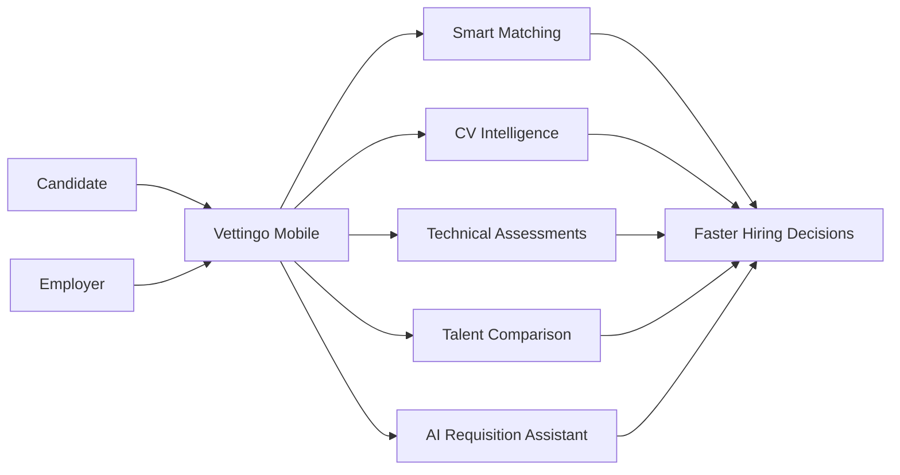
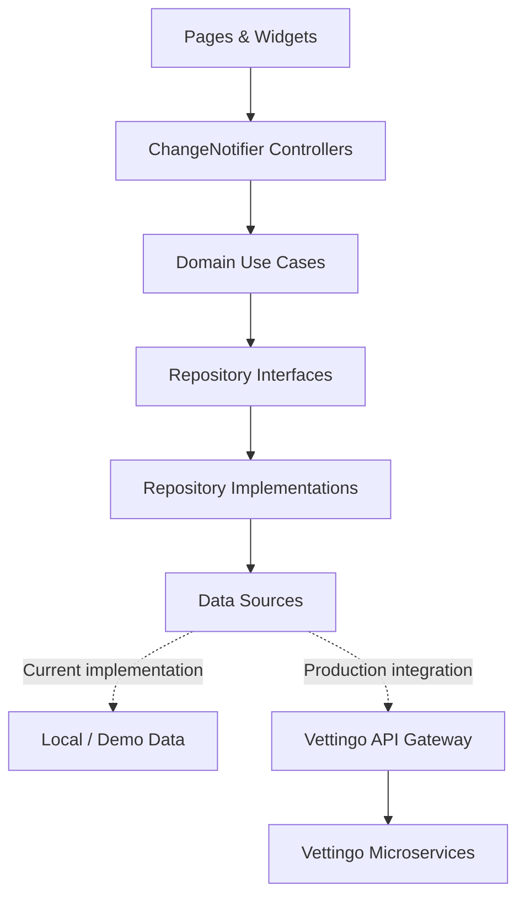
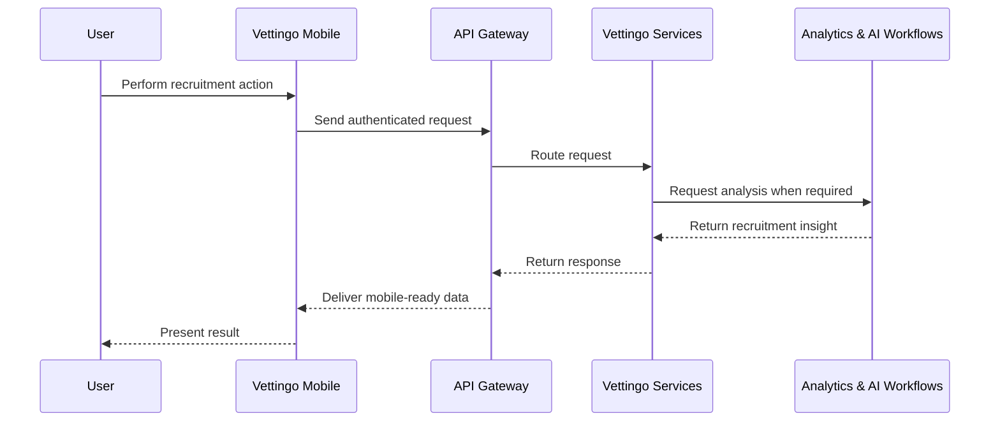

<div align="center">

# Vettingo Mobile

### The mobile experience for AI-assisted recruitment, candidate intelligence, and smarter hiring decisions

Vettingo Mobile brings candidate discovery, intelligent matching, assessments, CV analysis, talent comparison, and recruitment workflows together in a role-aware Flutter application.

<br />


</div>

---

## Overview

**Vettingo Mobile** is the mobile client of the Vettingo AI-assisted recruitment and candidate vetting platform.

The application turns complex hiring data into focused mobile workflows for candidates and employers. It provides job recommendations, candidate insights, technical assessments, CV review tools, talent comparison, requisition management, and recruitment pipeline actions through a modern role-aware interface.

The application is built with **Flutter** and **Dart** using a feature-based, Clean Architecture-inspired structure that separates presentation, business logic, and data access.

### User experiences

- **Candidate / Job Seeker**
- **Company / Employer**

Each account type receives a dedicated dashboard, navigation flow, and set of recruitment tools.

---

## Features

### Public experience

- Product landing page
- Turkish product presentation
- Responsive company showcase
- Candidate and Employer account selection
- Role-aware authentication flow
- Mobile-first navigation

### Candidate experience

- Personalized candidate dashboard
- Active application overview
- Application status tracking
- Candidate market profile score
- AI-assisted job recommendations
- Smart job-match percentages
- Job search and filtering
- Market intelligence insights
- Timed technical assessments
- Interactive assessment questions
- Answer selection and progress tracking

### Employer experience

- Employer recruitment dashboard
- Application and hiring metrics
- Top AI-matched candidates
- Active requisition overview
- Candidate talent comparison
- Candidate advancement and rejection actions
- Candidate detail and suitability analysis
- Interview scheduling
- Candidate pipeline management
- Multi-step requisition creation
- AI-assisted job description drafting

### Candidate intelligence

- AI executive candidate summaries
- Smart match percentages
- Role suitability analysis
- Requirement-level candidate evaluation
- Skill and competency comparison
- Professional experience timeline
- Education and certification details
- Candidate summary sharing
- Interview and pipeline actions

### CV review workflow

- Review parsed candidate information
- Edit professional summaries
- Add or remove candidate skills
- Review work experience
- Verify education information
- Complete and save CV reviews
- Repository-based state management

### Talent comparison

- Compare multiple candidates for a position
- Review role-specific match scores
- Inspect candidate skills and proficiency levels
- Navigate between candidate profiles
- Advance or reject candidates
- Preserve decisions during the comparison session

---

## AI-assisted recruitment experience

Vettingo Mobile is designed as the mobile presentation layer for Vettingo's intelligent recruitment capabilities.



The mobile interface presents AI-supported outputs such as:

- Candidate-to-role match percentages
- Recommended job opportunities
- Candidate executive summaries
- Role suitability indicators
- Market intelligence
- Candidate skill comparisons
- Top candidate recommendations
- AI-assisted job description drafts

---

## Application architecture

The project follows a **feature-first, Clean Architecture-inspired** structure.

Each business feature owns its presentation, domain, and data layers.



### Layer responsibilities

| Layer | Responsibility |
|---|---|
| **Presentation** | Pages, widgets, user interactions, and UI state |
| **Domain** | Entities, repository contracts, and application use cases |
| **Data** | Models, data sources, and repository implementations |
| **Core** | Theme, dependency composition, shared widgets, and application-wide utilities |

### Dependency direction

```text
Presentation → Domain ← Data
```

The domain layer remains independent from Flutter UI and data-source implementation details.

---

## State management

The application uses Flutter's lightweight `ChangeNotifier` pattern for feature-level state management.

Controllers are responsible for:

- Managing UI state
- Running domain use cases
- Handling form updates
- Tracking user selections
- Preserving workflow decisions
- Notifying the interface about changes

Dependencies are composed centrally through `AppDependencies`.

```dart
final controller = const AppDependencies()
    .createTalentComparisonController();
```

This structure allows local data sources to be replaced with API-backed implementations without rewriting presentation logic.

---

## Technology stack

| Category | Technology |
|---|---|
| **Framework** | Flutter |
| **Language** | Dart 3.12.2+ |
| **Design system** | Material Design 3 |
| **State management** | ChangeNotifier |
| **Architecture** | Feature-first, Clean Architecture-inspired |
| **Navigation** | Flutter named routes |
| **Dependency composition** | Centralized manual dependency injection |
| **Vector assets** | flutter_svg |
| **Static analysis** | flutter_lints |
| **Testing** | flutter_test |
| **Supported targets** | Android, iOS, Web |

The application uses a custom component and theme system instead of a third-party UI framework.

---

## Project structure

```text
Vettingo-Mobil/
├── android/
├── assets/
│   └── images/
│       └── company_logos/
├── ios/
├── lib/
│   ├── core/
│   │   ├── di/
│   │   ├── theme/
│   │   └── widgets/
│   │
│   ├── features/
│   │   ├── auth/
│   │   ├── candidate_assessment/
│   │   ├── candidate_detail/
│   │   ├── cv_review/
│   │   ├── dashboard/
│   │   ├── job_search/
│   │   ├── landing/
│   │   ├── new_requisition/
│   │   └── talent_comparison/
│   │
│   ├── app.dart
│   └── main.dart
│
├── test/
│   ├── candidate_profile_flows_test.dart
│   ├── dashboard_test.dart
│   ├── new_features_test.dart
│   ├── talent_comparison_test.dart
│   └── widget_test.dart
│
├── web/
├── analysis_options.yaml
├── pubspec.lock
└── pubspec.yaml
```

### Feature structure

Most application features follow the same internal structure:

```text
feature/
├── data/
│   ├── datasources/
│   ├── models/
│   └── repositories/
├── domain/
│   ├── entities/
│   ├── repositories/
│   └── usecases/
└── presentation/
    ├── controllers/
    └── pages/
```

This keeps UI code, business rules, and data access responsibilities clearly separated.

---

## Application routes

| Route | Experience |
|---|---|
| `/` | Product landing page |
| `/login` | Candidate and Employer login |
| `/candidate-dashboard` | Candidate dashboard |
| `/employer-dashboard` | Employer dashboard |
| `/job-search` | Smart job discovery |
| `/candidate-assessment` | Technical assessment session |
| `/talent-comparison` | Candidate comparison |
| `/candidate-detail` | Candidate intelligence profile |
| `/cv-review` | Parsed CV review |
| `/new-requisition` | Job requisition workflow |

Routes are registered centrally inside `VettingoApp`.

---

## Design system

Vettingo Mobile uses a custom Material 3 theme built around shared design tokens.

The design system includes:

- Centralized application colors
- Material 3 components
- Shared top and bottom navigation
- Consistent cards and surfaces
- Reusable form controls
- Responsive mobile layouts
- Consistent spacing and typography
- Feedback through dialogs, snackbars, and progress states
- SVG-based company branding assets

The application currently uses an **Inter-based** visual language with a focused, professional recruitment interface.

---

## Current development status

The current version is an interaction-ready mobile implementation using local and reference data sources.

`AppDependencies` currently connects features to:

- `FakeAuthDataSource`
- `LocalDashboardDataSource`
- `LocalJobSearchDataSource`
- `LocalCandidateAssessmentDataSource`
- `LocalTalentComparisonDataSource`
- `LocalCandidateDetailDataSource`
- `LocalCvReviewDataSource`
- `LocalRequisitionDataSource`

This makes the application independently runnable and allows its workflows to be tested without requiring backend services.

For production use, these local sources can be replaced by remote data sources communicating with the Vettingo API Gateway. AI-generated results displayed by the mobile interface will then be supplied by the platform's backend analytics and recruitment services.

---

## Getting started

### Prerequisites

Make sure the following tools are installed:

- [Flutter SDK](https://docs.flutter.dev/get-started/install)
- A Flutter version compatible with Dart `^3.12.2`
- Android Studio or Android SDK for Android development
- Xcode for iOS development
- Git

Verify your development environment:

```bash
flutter --version
flutter doctor
```

---

## Installation

### Clone the repository

```bash
git clone https://github.com/emreucbudak/Vettingo-Mobil.git
cd Vettingo-Mobil
```

### Install dependencies

```bash
flutter pub get
```

---

## Running the application

List the available devices:

```bash
flutter devices
```

Run the application on the selected device:

```bash
flutter run
```

Run it on a specific device:

```bash
flutter run -d <device-id>
```

### Run on the web

```bash
flutter run -d chrome
```

> iOS builds require macOS and Xcode.

---

## Code quality

Run Flutter's static analysis:

```bash
flutter analyze
```

Format the source code:

```bash
dart format lib test
```

---

## Testing

Run the complete test suite:

```bash
flutter test
```

The test suite covers:

- Landing-page navigation
- Candidate and Employer account selection
- Authentication controller state
- Candidate dashboard content
- Employer dashboard metrics
- Talent comparison decisions
- Candidate advancement and rejection
- Technical assessment answers
- Job-search filtering
- Requisition validation
- CV data editing
- Candidate-detail interactions
- Interview and pipeline actions

Run a specific test file:

```bash
flutter test test/talent_comparison_test.dart
```

---

## Building

### Android APK

```bash
flutter build apk --release
```

### Android App Bundle

```bash
flutter build appbundle --release
```

### iOS

```bash
flutter build ios --release
```

### Web

```bash
flutter build web --release
```

Build artifacts are generated under the `build/` directory.

---

## Backend integration

The production mobile application is designed to communicate with the central Vettingo API Gateway.



The related backend provides:

- JWT authentication and role authorization
- Job posting management
- Job applications
- Technical assessments
- Structured interviews
- Candidate evaluations
- CV analysis
- Candidate recommendations
- Recruitment analytics
- Real-time notifications

The central API Gateway uses the following default local address:

```text
http://localhost:5135
```

When Android Emulator integration is added, the host machine is typically reached through:

```text
http://10.0.2.2:5135
```

---

## Development guidelines

When adding a new feature:

1. Create a dedicated folder under `lib/features/`.
2. Define business entities and repository contracts in `domain/`.
3. Add focused use cases for user actions.
4. Implement models, repositories, and data sources in `data/`.
5. Manage UI state through a presentation controller.
6. Build the screen under `presentation/pages/`.
7. Register dependencies through `AppDependencies`.
8. Add unit and widget tests for the workflow.

When adding backend integration:

1. Keep HTTP logic inside remote data sources.
2. Convert API DTOs into domain entities through data models.
3. Keep repository contracts independent from networking libraries.
4. Handle loading, success, empty, and error states.
5. Store authentication tokens securely.
6. Route requests through the Vettingo API Gateway.
7. Avoid placing network calls directly inside widgets.

---

## Related repositories

### Vettingo Backend

Microservices, API Gateway, authentication, persistence, analytics, and recruitment workflows:

[Vettingo Backend](https://github.com/emreucbudak/Vettingo)

### Vettingo Frontend

The Next.js web experience for candidates, employers, and human resources teams:

[Vettingo Frontend](https://github.com/emreucbudak/Vettingo-Frontend)

---

## Contributing

Contributions are welcome.

1. Fork the repository.
2. Create a feature branch.

```bash
git checkout -b feature/your-feature-name
```

3. Implement the feature using the existing architecture.
4. Add or update tests.
5. Run the quality checks.

```bash
flutter analyze
flutter test
```

6. Commit your changes and open a pull request.

---

<div align="center">

Built with **Flutter**, **Dart**, and the Vettingo AI-assisted recruitment ecosystem.

</div>
