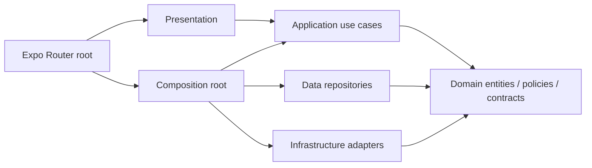

# Mobil Clean Architecture

Uygulama Expo SDK 57 ve React Native ile çalışır. Mimari katmanlar bağımlılıkların içeriye yönelmesini sağlar; domain ve application içinde React, React Native, Expo, AsyncStorage veya ekran import'u yoktur.

## Katmanlar

| Katman                 | Görev                                                                                              |
| ---------------------- | -------------------------------------------------------------------------------------------------- |
| `domain/entities`      | Session, CV, aday, ilan, değerlendirme ve çalışma alanı modelleri                                  |
| `domain/policies`      | Form, CV, tarih, dosya boyutu, arama, aşama ve değerlendirme kuralları                             |
| `domain/repositories`  | AuthRepository, WorkspaceRepository, RecruitmentRepository sözleşmeleri                            |
| `domain/ports`         | Saat, belge seçici ve paylaşım sözleşmeleri                                                        |
| `application/usecases` | Giriş/çıkış, katalog sorguları, başvuru, CV tamamlama, aday kararı, ilan ve değerlendirme akışları |
| `data`                 | Demo kaynakları, JSON mapper ve AsyncStorage kullanan repository uygulamaları                      |
| `infrastructure`       | SystemClock, ExpoCvDocumentPicker ve ReactNativeSummarySharer                                      |
| `presentation`         | Ekranlar, bileşenler, React Context, form state'i, etiketler ve rota seçimi                        |
| `composition`          | Somut repository ve port uygulamalarını use case constructor'larına bağlar                         |
| `app`                  | Expo Router yolları, rol korumaları ve composition root'un uygulamaya verilmesi                    |

Oklar import bağımlılıklarını gösterir. Application somut repository'leri import etmez; domain arayüzlerinden verilen nesneleri kullanır. UI renkleri, Türkçe rol etiketleri, rota adları ve hukuki içerik presentation içinde kalır.

## Ekrandan iş kuralına

`AuthScreen`, form hata gösterimini yönetir; `SessionUseCases` giriş verisini doğrular, `AuthRepository` üzerinden demo kimliği alır ve hesaba ait çalışma alanını yükler. Şifre Session modeline veya kalıcı kayda aktarılmaz.

CV, ilan ve mülakat ekranları form state'ini tutar. Tamamlama, yayınlama ve karar verme kuralları ilgili use case içinde de uygulanır. `WorkspaceCommand` application sözleşmesidir; `WorkspaceUseCases` komutları `CvUseCases`, `CandidateUseCases`, `RequisitionUseCases`, `AssessmentUseCases` ve `ApplicationUseCases` sınıflarına yönlendirir. React Context yalnızca bu sonuçları UI state'ine uygular ve kayıt yaşam döngüsünü başlatır.

`RecruitmentQueries.load()` asenkron repository'den kataloğu yükler. Sorgular daha sonra bu katalog üzerinde çalışır. Ekranlar katalog ve oturum yüklenmeden açılmaz. Veri yüklemesi başarısız olursa tekrar deneme gösterilir. Saat portu değerlendirme süresi, mülakat doğrulaması ve ilan kimliği için enjekte edilir. Belge seçimi ve paylaşım da port üzerinden çağrılır.

## Kalıcı kayıt

`LocalWorkspaceRepository` hesap ve rol bazında çalışma alanını yükler/kaydeder. `workspaceMapper` bozuk veya farklı sürümlü JSON'u demo başlangıç verisine döndürür. Eski `vettingo:workspace:v1:<rol>:<e-posta>` ve `vettingo:demo-session:v1` anahtarları korunmuştur. Bu refactor veriyi silmez veya yeniden sürümlendirmez.

Auth ve workspace repository'leri aynı `AsyncStorageSource` nesnesini paylaşır. Yazmalar sıraya alınır; hesap değiştirirken ve çıkarken önce bekleyen kayıtlar tamamlanır. Böylece önceki bir yazma yeni kaydın üzerine geçmez. Kayıt hataları ekranda gösterilir.

## Backend bağlama

Mevcut adapter'lar yerel demo davranışını korur. API bağlantısı bu değişikliğe dahil değildir.

`AuthRepository`, `RecruitmentRepository` ve `WorkspaceRepository` arayüzlerini uygulayan API/cache repository'leri eklenip `createAppServices.ts` içinde seçilebilir. Backend cevaplarının domain entity'lerine dönüşümü data mapper'larında yapılmalıdır. Katalog yükleme sözleşmesi zaten asenkrondur; uzaktan sayfalama veya farklı sorgu ihtiyaçları gelirse repository ve query sözleşmeleri genişletilir. Gerçek token saklama ve sunucu yetkilendirmesi ayrıca uygulanmalıdır.

## Sınırların korunması

ESLint, domain/application içinde framework ve dış katman import'larını engeller. Presentation içinde data, infrastructure, composition, AsyncStorage ve Expo belge seçici import'ları engellenir. Data/infrastructure ekranlara veya application'a bağımlı olamaz. Bağlantılar yalnızca composition root'ta kurulur.

Mevcut 24 test yeni yolları, enjekte edilen use case'leri ve saati kullanacak şekilde güncellendi. Formlar, arama, kayıt izolasyonu, aday kararları, CV, ilan ve değerlendirme davranışları korunur. Testler, typecheck ve lint GitHub Actions'ta çalışır.
