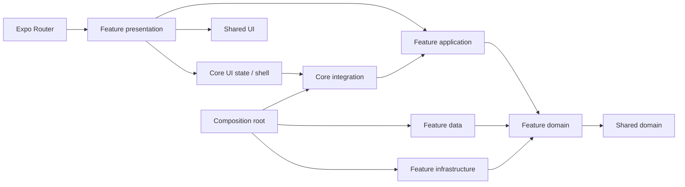

# Mobil Feature-first Clean Architecture

Kod önce işlevlere, sonra o işlevin katmanlarına göre düzenlenir. Expo Router yolları `src/app` altında kalır ve feature ekranlarına yönlendirir. Domain ve application framework bağımsızdır.

## Özellik sahipliği

| Feature      | Sahip olduğu kod                                                                                                                                                |
| ------------ | --------------------------------------------------------------------------------------------------------------------------------------------------------------- |
| auth         | Session/Role, form kuralları, AuthRepository, AuthUseCases, yerel kimlik doğrulama, giriş/kayıt ve hukuki içerik                                                |
| jobs         | Job modeli, iş arama/filtre politikası, JobsRepository/JobsQueries, demo işler, JobCard ve arama ekranı                                                         |
| applications | Application modeli, ApplicationUseCases, başlangıç başvuruları, ApplicationCard ve başvuru listesi                                                              |
| candidates   | Candidate/Decision/Stage, aday ve mülakat kuralları, CandidatesRepository/Queries, karar/paylaşım use case'i, demo adaylar, kart, liste, detay ve karşılaştırma |
| cv           | Cv modeli, CV/dosya kuralları, belge seçici portu/adaptörü, CvUseCases, demo CV ve düzenleme ekranı                                                             |
| requisitions | Requisition/RequisitionState, ilan kuralları, katalog repository/query, taslak/yayın use case'i, demo ilanlar, kart ve ekranlar                                 |
| assessment   | Question/Assessment, süre kuralları, soru repository/query, değerlendirme use case'i, başlangıç verileri ve ekran                                               |
| account      | Hesap/profil ekranı                                                                                                                                             |
| dashboard    | Diğer feature'ların kartlarını birleştiren ana sayfalar                                                                                                         |

Örneğin adaylarla ilgili bir değişiklik `src/features/candidates` içinde bulunur:

```text
features/candidates/
  domain/
    entities/          Candidate, CandidateDecisions, CandidateCatalog
    policies/          Aşama ve mülakat kuralları
    repositories/      CandidatesRepository
    ports/             SummarySharer
  application/usecases/ CandidateUseCases, CandidatesQueries
  data/
    fixtures/          Aday demo içeriği
    repositories/      DemoCandidatesRepository
  infrastructure/      ReactNativeSummarySharer
  presentation/
    components/        CandidateCard
    formatters/        Aşama/karar etiketleri
    screens/           Liste, detay, karşılaştırma
```

Her feature yalnızca ihtiyaç duyduğu katmanları içerir. Account/dashboard için boş domain veya data klasörleri yoktur. Ortak model, fixture veya ekranları tekrar dıştaki genel katmanlara taşıyan uyumluluk barrel'ları tutulmaz.

## Core ve shared

`core` uygulama genelindeki entegrasyonu taşır: `AppServices`, `SessionUseCases`, `WorkspaceUseCases`, `WorkspaceCommand`, eski kayıt şeması olan `Workspace`, kayıt mapper/repository'si, `AppProvider` ve `AppShell`.

Feature use case'leri Workspace modelini import etmez. Başvuru use case'i Application listesini, aday kararı CandidateDecisions'ı, değerlendirme Assessment'ı, ilan use case'i RequisitionState'i alır. Core komut yönlendiricisi bu sonuçları uygulama state'ine birleştirir. CV doğrudan Cv modeliyle çalışır. AuthUseCases kimlik doğrulamayı yönetir; core SessionUseCases hesaba ait workspace yükleme/kayıt akışını tamamlar.

`shared` yeniden kullanılabilir UI bileşenleri/renkler, metin arama, Experience/Education tipleri, Clock portu, SystemClock ve AsyncStorageSource içerir. Feature veya core import etmez. Uygulama state'ine ve gezinmeye bağlı AppShell bu nedenle core içinde kalır.

Başvuru akışı jobs domain modelini tüketir. Dashboard farklı feature'ların presentation kartlarını birleştirir. Bu açık bağlantılar dış katmanların domain/application içine taşınmasını gerektirmez.

## Bağımlılık yönü



Somut bağlantılar yalnızca `src/composition/createAppServices.ts` içinde kurulur. Jobs, candidates, assessment ve requisitions katalogları kendi asenkron repository'lerinden yüklenir. `loadCatalogs()` bunları başlangıçta birlikte yükler; ekranlar katalog ve oturum hazır olmadan açılmaz. Yükleme hatasında tekrar deneme gösterilir.

## Kalıcı kayıt ve backend

`core/data/repositories/LocalWorkspaceRepository.ts`, hesap/rol bazında eski v1 JSON şemasını korur. `vettingo:workspace:v1:<rol>:<e-posta>` ve `vettingo:demo-session:v1` anahtarları değişmez. Refactor mevcut kayıtları silmez. Mapper bozuk veya farklı sürümlü kayıt için başlangıç verisine döner.

Auth ve workspace repository'leri aynı AsyncStorageSource nesnesini paylaşır. Yazmalar sıraya alınır; hesap değişiminde/çıkışta önce bekleyen yazmalar tamamlanır. Şifre Session modeline veya kalıcı kayda aktarılmaz.

Mevcut repository'ler yerel demo davranışını sürdürür. API/cache adaptörleri ilgili feature'ın data katmanında repository arayüzünü uygulayıp composition içinde seçilebilir. Backend cevapları feature modellerine data mapper'larında dönüştürülmelidir. Sayfalama veya yeni sorgular için ilgili feature'ın sözleşmeleri genişletilir. Gerçek auth/token ve sunucu yetkilendirmesi ayrıca bağlanmalıdır.

## Kontroller

ESLint tüm feature/core/shared yollarındaki Clean Architecture sınırlarını kontrol eder. Feature domain/application core'a bağımlı olamaz; shared hiçbir feature'a veya core'a bağımlı olamaz. Presentation somut data/infrastructure/composition, AsyncStorage veya belge seçici import edemez. Framework bağımlılıkları domain/application'a giremez.

Mevcut 24 test yeni feature yollarına ve use case bağlantılarına taşındı. Entegrasyon testleri birden fazla feature ve kalıcı kayıt davranışını birlikte kontrol ettiği için `tests` altında kalır. TypeScript, lint, test ve web paketleme GitHub Actions'ta çalışır.
